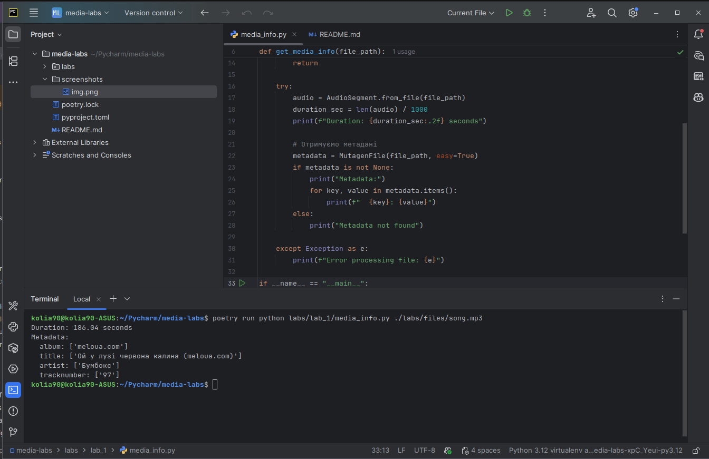

## Аналіз медіа файлів з використанням хмарних технологій та Python

### Встановлення залежностей:

    poetry install

### Лабораторна робота №1:

```
    poetry run python labs/lab_1/media_info.py ./files/song.mp3
```

```
    Duration: 186.04 seconds
    Metadata:
      album: ['meloua.com'
      title: ['Ой у лузі червона калина (meloua.com)']
      artist: ['Бумбокс']
      tracknumber: ['97']
```


