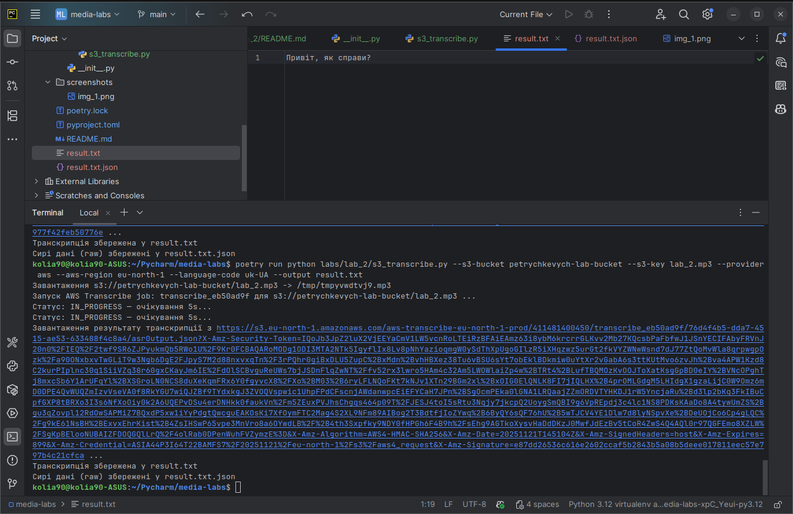

## Аналіз медіа файлів з використанням хмарних технологій та Python

### Лабораторна робота №2:

Install & Configure AWS client

```
    poetry add awscli
    poetry run aws configure
```

Транскрибація аудіо файлів з використанням AWS Transcribe

```
    poetry run python labs/lab_2/s3_transcribe.py --s3-bucket petrychkevych-lab-bucket --s3-key lab_2.mp3 --provider aws --aws-region eu-north-1 --output result.txt
```

Транскрибація аудіо файлів з використанням Google Cloud Speech-to-Text

```
    poetry run python labs/lab_2/s3_transcribe.py --s3-bucket petrychkevych-lab-bucket --s3-key lab_2.mp3 --provider gcp --gcp-language-code uk-UA --output result_gcp.txt
```

