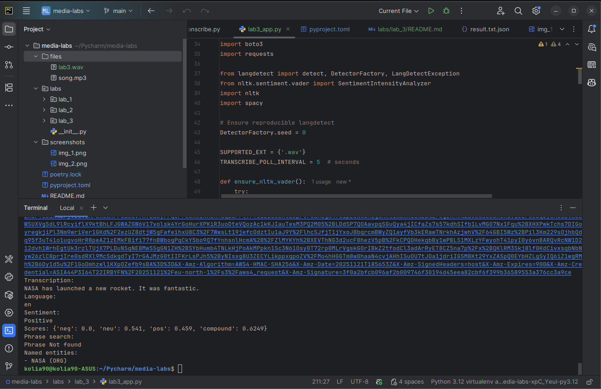

## Аналіз медіа файлів з використанням хмарних технологій та Python

### Лабораторна робота №3:

Install requirements:

```
    poetry add requests spacy nltk langdetect
```

Load models and data:

```
    poetry run python -m spacy download en_core_web_sm
    poetry run python -c "import nltk; nltk.download('vader_lexicon')"
```

Run script:

```
    poetry run python labs/lab_3/lab3_app.py --audio-source files/lab3.wav --phrase "hello world" --s3-bucket petrychkevych-lab-bucket --aws-region eu-north-1
```


